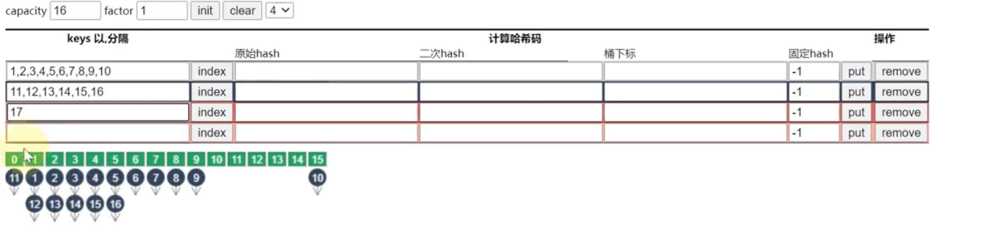
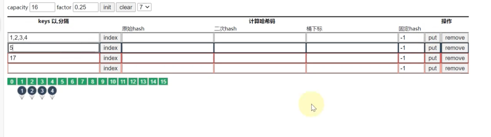
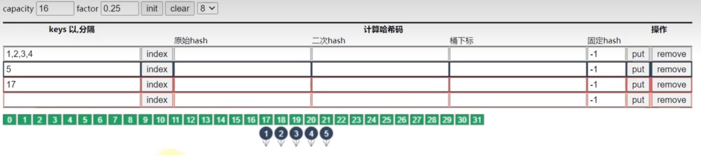

## map

> src/runtime/map.go

```go
// Go map 的头部。
type hmap struct {
// 注意：hmap 的格式也被编码在 cmd/compile/internal/reflectdata/reflect.go 中。
// 确保这个定义与编译器的定义保持同步。
count     int   // 存储在 map 中的键值对数量。必须是第一个字段（用于内置函数 len()）
flags     uint8 // 表示 map 的状态标志，包括了迭代器是否在使用中、是否正在进行扩容等信息。
B         uint8 // 存储桶的数量的对数，实际桶的数量为len(buckets) == 2^B(bucketShift bucket的位移值)。 
noverflow uint16 // 溢出桶数量的估计值。 number of overflows
hash0     uint32 // 哈希种子。

buckets    unsafe.Pointer // 存储键值对的桶数组，其长度为 2^B。如果 count 为 0，则可能为 nil。
oldbuckets unsafe.Pointer // 扩容时旧的桶数组，长度为 2^(B-1)，用于数据搬迁。如果没有扩容，则为 nil。
nevacuate  uintptr        // 扩容时已经完成搬迁的桶数量。 "not evacuate"

extra *mapextra // 可选字段，指向了一些额外的 map 属性，例如 map 的类型信息和哈希函数。
}

```

```go
// mapextra 包含了一些不是所有 map 都有的字段。
type mapextra struct {
// 如果 key 和 elem 都不包含指针，并且它们都可以内联，那么我们标记 bucket 的类型不包含指针。
// 这样可以避免扫描这样的 map。
// 然而，bmap.overflow 是一个指针。为了保持溢出桶的存活状态，我们在 hmap.extra.overflow 和 hmap.extra.oldoverflow 中存储了指向所有溢出桶的指针。
// 只有当 key 和 elem 都不包含指针时才使用 overflow 和 oldoverflow。
// overflow 存储 hmap.buckets 的溢出桶。
// oldoverflow 存储 hmap.oldbuckets 的溢出桶。
// 间接存储允许在 hiter 中存储一个指向切片的指针。
overflow *[]*bmap
oldoverflow *[]*bmap
// nextOverflow 指向一个空闲的溢出桶。
nextOverflow *bmap
}

```
```go
// Go map 的 bucket。 bmap equal bucket map
type bmap struct {
// tophash 通常包含此 bucket 中每个 key 的 hash 值的高字节。 存储了键的哈希的高 8 位
// 如果 tophash[0] < minTopHash，则 tophash[0] 是一个 bucket 撤离状态。
tophash [bucketCnt]uint8 // bucketCnt equal bucket count
// 接下来是 bucketCnt 个 key，然后是 bucketCnt 个 elem。
// 注意：将所有 key 放在一起，然后将所有 elem 放在一起比交替 key/elem/key/elem/... 代码更复杂，但可以消除需要填充的情况，例如 map[int64]int8。
// 最后是一个溢出指针。
}

src/cmd/compile/internal/reflectdata/reflect.go::MapBucketType

type bmap struct {
topbits  [8]uint8
keys     [8]keytype
values   [8]valuetype
pad      uintptr
overflow uintptr
}
```
```uml
 +--------------------------------+          +--------------------------------+
|             hmap               |          |            mapextra            |
+--------------------------------+          +--------------------------------+
| - count: int                   |          | - overflow: []*bmap           |
| - flags: uint8                 |          | - oldoverflow: []*bmap       |
| - B: uint8                     |          | - nextOverflow: *bmap         |
| - noverflow: uint16            |          +--------------------------------+
| - hash0: uint32                |                     |
| - buckets: unsafe.Pointer     |                     |
| - oldbuckets: unsafe.Pointer  |                     |
| - nevacuate: uintptr           |                     |
| - extra: *mapextra             |                     |
+--------------------------------+                     |
             ^                                        |
             |                                        |
             +----------------------------------------+
                           |
                           |
                           v
+--------------------------------+
|             bmap               |
+--------------------------------+
| - tophash: [bucketCnt]uint8    |
| - keys: [bucketCnt]keyType     |
| - values: [bucketCnt]valType   |
| - overflow: *bmap             |
+--------------------------------+

```
```go

const (
// 一个 bucket 最多能容纳的键值对数。
bucketCntBits = 3
bucketCnt = 1 << bucketCntBits

// 触发扩容的最大平均负载因子是 6.5。
// 表示为 loadFactorNum/loadFactorDen，以便进行整数计算。
loadFactorNum = 13
loadFactorDen = 2

// 保持内联（而不是为每个元素分配内存）的最大键或元素大小。
// 必须适合 uint8。
// 快速版本无法处理大元素，因此在 cmd/compile/internal/gc/walk.go 中的快速版本的截止大小必须最大为此元素大小。
maxKeySize = 128
maxElemSize = 128

// 数据偏移应为 bmap 结构的大小，但需要正确对齐。
// 对于 amd64p32，这意味着需要 64 位对齐，即使指针是 32 位的。
dataOffset = unsafe.Offsetof(struct {
b bmap
v int64
}{}.v)

// 可能的 tophash 值。我们为特殊标记保留了一些可能性。
// 每个 bucket（包括其溢出 bucket（如果有））将具有其所有条目处于 evacuated* 状态（除了 evacuate() 方法期间，该方法仅在 map 写入期间发生，因此在此期间没有其他人可以观察 map）。
emptyRest = 0 // 这个单元格为空，并且没有更高索引或溢出中的非空单元格。
emptyOne = 1   // 这个单元格为空
evacuatedX = 2 // key/elem 是有效的。该 entry 已疏散到更大表的第一半中。
evacuatedY = 3 // 与上面相同，但疏散到更大表的第二半中。
evacuatedEmpty = 4 // 单元格为空，bucket 已疏散。
minTopHash = 5     // 正常填充单元格的最小 tophash 值。

// 标志
iterator = 1    // 可能有一个使用 buckets 的迭代器
oldIterator = 2 // 可能有一个使用 oldbuckets 的迭代器
hashWriting = 4 // 一个 goroutine 正在写入 map
sameSizeGrow = 8 // 当前 map 的增长是到同样大小的新 map。

// 迭代器检查的哨兵 bucket ID
noCheck = 1<<(8*goarch.PtrSize) - 1


)

```
```go
// 一个哈希迭代器结构体。
// 如果你修改了hiter，也要相应地修改cmd/compile/internal/reflectdata/reflect.go和reflect/value.go以匹配此结构体的布局。
type hiter struct {
key unsafe.Pointer // 必须位于第一个位置。将其写为nil表示迭代结束（参见cmd/compile/internal/walk/range.go）。
elem unsafe.Pointer // 必须位于第二个位置（参见cmd/compile/internal/walk/range.go）。
t *maptype // map的类型信息。
h *hmap // 迭代的哈希表。
buckets unsafe.Pointer // 在hash_iter初始化时存储的bucket指针。
bptr *bmap // 当前bucket。
overflow *[]*bmap // 保持hmap.buckets的溢出bucket存活。
oldoverflow *[]*bmap // 保持hmap.oldbuckets的溢出bucket存活。
startBucket uintptr // 迭代开始时的bucket。
offset uint8 // 在迭代过程中开始的bucket内偏移量（应足够大，以容纳bucketCnt-1）。
wrapped bool // 是否已经从bucket数组的末尾回到开头。
B uint8 // log_2 of # of buckets (size of buckets array == 1<<B)
i uint8 // 桶内偏移量。
bucket uintptr // 当前的bucket指针。
checkBucket uintptr // 用于迭代器检查的哨兵bucket ID。
}
```

> src/runtime/type.go

```go
// maptype 是 map 类型的元信息结构
type maptype struct {
typ _type  // 该 map 类型的类型信息
key *_type // key 的类型信息指针
elem *_type   // value 的类型信息指针
bucket *_type // 内部类型，表示哈希桶
hasher func (unsafe.Pointer, uintptr) uintptr // 哈希函数指针，根据 key 和 seed 计算出哈希值
keysize uint8                                 // key slot 的大小
elemsize uint8    // elem slot 的大小
bucketsize uint16 // bucket 的大小
flags uint32      // map 的标志位
}

```

## hash冲突解决

### 开放寻址法

数组中元素的数量与数组大小的比值

loadFactor =  100% 变成  𝑂(𝑛)

### 拉链法 

大多数语言实现,golang

装载因子:=元素数量÷桶数量

## 负载因子

负载因子是指哈希表中已存储键值对数量与哈希表长度的比值，通常用 Load Factor 表示，即 LF = N/M，其中 N 表示已存储键值对的数量，M 表示哈希表的长度。

在哈希表中，负载因子的大小会影响哈希表的性能。当负载因子较小时，哈希表中的空闲槽位较多，查找、插入、删除等操作的时间复杂度都会比较小，但空间利用率较低；当负载因子较大时，哈希表中的空闲槽位较少，空间利用率较高，但查找、插入、删除等操作的时间复杂度都会比较大。

对于 Go 语言中的 map 类型，其默认的负载因子是 6.5，即当已存储键值对数量与哈希表长度的比值达到 6.5 时，Go 会自动对哈希表进行扩容，以提高哈希表的性能。


下面以java语言map的理解例子代入go中

负载因子为1,链表长度为2

超过16时扩容


> 当负载因子较大时，哈希表中的空闲槽位较少，空间利用率较高，但查找、插入、删除等操作的时间复杂度都会比较大

负载因子0.25时

负载因子0.25,输入第5个元素 容量16/0.25=4 触发扩容


> 当负载因子较小时，哈希表中的空闲槽位较多，查找、插入、删除等操作的时间复杂度都会比较小，但空间利用率较低

## 创建map


```go
hash := map[string]int{
	"1": 2,
	"3": 4,
	"5": 6,
}
```
> src/cmd/compile/internal/walk/complit.go
> 
> func maplit(n *ir.CompLitExpr, m ir.Node, init *ir.Nodes) 

 将一个复合字面量（composite literal）转换为一个 map 类型的变量。

函数首先创建一个 map 类型的变量，并将其分配给传入的 m 变量。然后，它遍历复合字面量中的键值对，并将它们插入到 map 中。

如果复合字面量中的键值对数量较小，则直接将其插入到 map 中。否则，函数会将键和值分别放入两个静态的数组中，并使用循环将其逐个插入到 map 中。这样可以避免在大型 map 中进行过多的内存分配和复制操作。

该函数的实现比较复杂，包含了许多与类型检查、变量赋值、静态数组初始化、循环等相关的操作。


`func makemap(t *maptype, hint int, h *hmap) *hmap `

##  查找map

```go
v     := hash[key] // => v     := *mapaccess1(maptype, hash, &key)
v, ok := hash[key] // => v, ok := mapaccess2(maptype, hash, &key)
```
> src/cmd/compile/internal/walk/expr.go
> 
> walkExpr
```go
case ir.OINDEXMAP:
n := n.(*ir.IndexExpr)
return walkIndexMap(n, init) // `mapaccess1` src/runtime/map.go

// a,b = m[i]
case ir.OAS2MAPR:
n := n.(*ir.AssignListStmt)
return walkAssignMapRead(init, n) // `mapaccess2` src/runtime/map.go
```
用于选择桶序号的是哈希的最低几位，而用于加速访问的是哈希的高 8 位，这种设计能够减少同一个桶中有大量相等 tophash 的概率影响性能

## 写入

`mapassign`

## 删除
`mapdelete`

## 扩容
in `mapassign`

渐进式扩容,避免瞬时性能抖动,扩容过程不是原子的

条件
- 装载因子已经超过 6.5
- 哈希使用了太多溢出桶 ｜ 等量扩容 sameSizeGrow

```go
// evacDst 是一个搬移目标位置的结构体。
type evacDst struct {
    b *bmap          //bucket 当前搬移目标桶的指针。
    i int            //index 当前需要搬移的键值对在 b 桶中的下标。
    k unsafe.Pointer //key 当前需要搬移的键的内存地址。
    e unsafe.Pointer //elem 当前需要搬移的值的内存地址。
}
```

> ref: https://github.com/cch123/golang-notes/blob/master/map.md
> 
> https://golang.design/go-questions/map/principal/
> 
> https://draveness.me/golang/docs/part2-foundation/ch03-datastructure/golang-hashmap/
> 
> https://www.bilibili.com/video/BV1Sp4y1U7dJ/